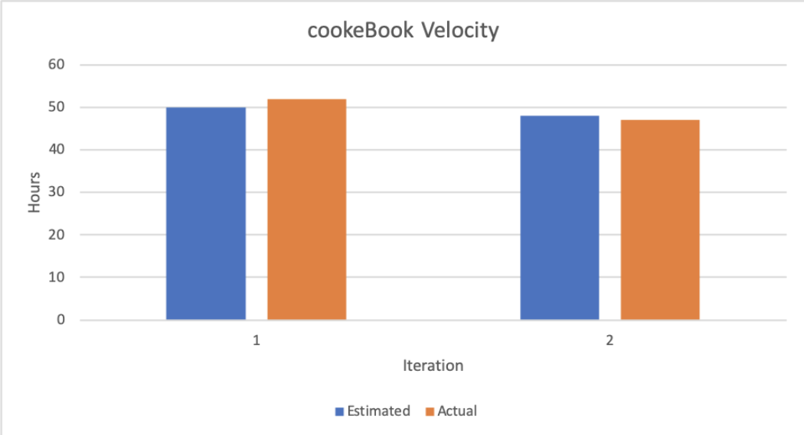

# Retrospective

## Discussion

Overall, the cook eBook project was a great success, and the group as a whole worked really well together to accomplish shared goals. However, there were definitely areas that we could have improved upon to make our development process even smoother.

### Communication

The first area that could use improvement was communication. Overall, the team communicated well with one another and had good organization of iterations and tasks. However, issues did arise on occasion when tasks would overlap and two people would end up implementing identical functionality. This issue was mitigated by mandating that each separate developer task must have its own new branch and “work in progress” (WIP) merge request. This meant that at any point, any team member could glance at the open merge requests and see what was being worked on (and even provide constructive feedback in the earlier stages of development)

### Code Review

Additionally another area that could be improved on is more careful code review for new features. There was an issue along the way where a fair amount of dead code was included in a substantial merge request. While this was eventually caught and dealt with before the iteration was due, it was a while before anyone noticed, and could have just as easily slipped its way under the radar and made it into a release. In this case, the issue should have ideally been noticed when the code was being reviewed for merge. To ensure a similar scenario wouldn't occur in the future, a new minimum of two ‘thumbs up’ on GitLab was a requirement to any new code being merged. As a result from this change,  dead code was caught quicker, easier and most importantly, before merging in a new feature or task. In the same vein, by making an effort to keep merge requests small, it was easier to process the scope of the merge request, and see any issues with it. There were however exceptions to this, for example when the database was initially implemented, and when a major data refactor occurred. In these cases, the merge requests got unwieldy in size and scope, and despite the entire team reading and reviewing the code, issues still slipped through. Having smaller merge requests ensures it’s easier to see changes and possible issues that they could introduce.

### Time Management

Lastly, an issue that came up was time management. Primarily for the second iteration, all team members had lots of other classes and commitments, which lead to the bulk of the iteration’s work being completed during the last weekend before the due date. This was not only extremely stressful for everybody, but also presented difficulties that arose from certain features depending on each other, sometimes features that had not been implemented yet. yet. This issue was mitigated for the final iteration, where a rough schedule was laid out for team members to implement certain features in order to ensure smoother development, which ended up being much more successful.

### Success

The success of the final iteration will be evaluated based on a few things. Firstly, a successful improvement would be lower stress levels across the board. When team members are less stressed, it usually indicates better time management. Less stress also could lead to both higher quality code and happier contributors. This measurement is qualitative and would be a self measurement. Another metric by which to measure this iteration’s success would be in overlap of code submission. By reducing the amount of repeated work across group members, it would signify that communication skills were improved, and that the measures taken worked, to ensure team members had a good idea of what was being worked on. Another measure of success would be continuing to keep all new merge requests small to ensure that they be reviewed properly and have less dead code being merged in. Lastly, this iteration would be most successful if Rob gave us 100% on our iteration. :)

## Project Velocity

