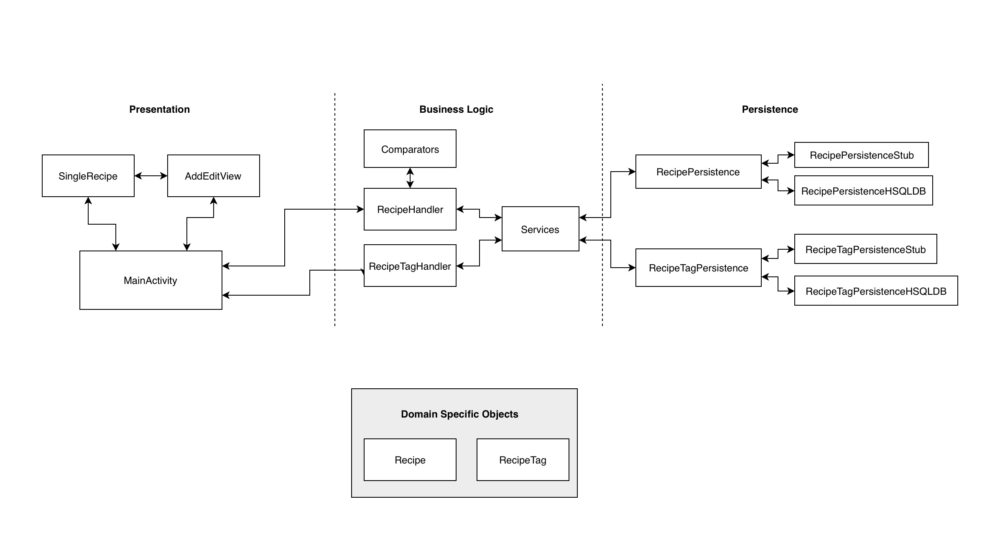

# Architecture

**Directory of Classes and their locations**

## Iteration 2 Diagram

## Iteration 1 Diagram

## Presentation Layer
[MainActivity](https://code.cs.umanitoba.ca/comp3350-summer2019/cook-eBook/blob/master/app/src/main/java/com/cook_ebook/presentation/MainActivity.java)
- The file for the view for the starting screen of the app

[AddEditView](https://code.cs.umanitoba.ca/comp3350-summer2019/cook-eBook/blob/master/app/src/main/java/com/cook_ebook/presentation/AddEditView.java)
- The file for the view for adding or editing a recipe

[RecyclerViewAdapter](https://code.cs.umanitoba.ca/comp3350-summer2019/cook-eBook/blob/master/app/src/main/java/com/cook_ebook/presentation/RecyclerViewAdapter.java)
- A supporting view file for the MainActivity

[SingleRecipe](https://code.cs.umanitoba.ca/comp3350-summer2019/cook-eBook/blob/master/app/src/main/java/com/cook_ebook/presentation/SingleRecipe.java)
- The file for the view for viewing a single recipe

## Application Layer
[Services](https://code.cs.umanitoba.ca/comp3350-summer2019/cook-eBook/blob/master/app/src/main/java/com/cook_ebook/application/Services.java)
- The main class that deals with the persistence layer for the Recipe Handler

[Main](https://code.cs.umanitoba.ca/comp3350-summer2019/cook-eBook/blob/master/app/src/main/java/com/cook_ebook/application/Main.java)
- The main class that sets up the new database

## Logic Layer
[RecipeHandler](https://code.cs.umanitoba.ca/comp3350-summer2019/cook-eBook/blob/master/app/src/main/java/com/cook_ebook/logic/RecipeHandler.java)
- The main class that the presentation layer will call to do stuff with the data

[RecipeTagHandler](https://code.cs.umanitoba.ca/comp3350-summer2019/cook-eBook/blob/master/app/src/main/java/com/cook_ebook/logic/RecipeTagHandler.java)
- The main class that the presentation will call to do stuff with tags

[RecipeValidator](https://code.cs.umanitoba.ca/comp3350-summer2019/cook-eBook/blob/master/app/src/main/java/com/cook_ebook/logic/RecipeValidator.java)
- The main class that deals with validating a recipe

### Exceptions
[InvalidCookingTimeException](https://code.cs.umanitoba.ca/comp3350-summer2019/cook-eBook/blob/master/app/src/main/java/com/cook_ebook/logic/exceptions/InvalidCookingTimeException.java)
- The exception class for invalid cooking times

[InvalidRecipeException](https://code.cs.umanitoba.ca/comp3350-summer2019/cook-eBook/blob/master/app/src/main/java/com/cook_ebook/logic/exceptions/InvalidRecipeException.java)
- The exception class for invalid Recipes

[InvalidRecipeTitle](https://code.cs.umanitoba.ca/comp3350-summer2019/cook-eBook/blob/master/app/src/main/java/com/cook_ebook/logic/exceptions/InvalidRecipeTitle.java)
- The exception class for invalid Recipe Titles

[NegativeCookingTimeException](https://code.cs.umanitoba.ca/comp3350-summer2019/cook-eBook/blob/master/app/src/main/java/com/cook_ebook/logic/exceptions/NegativeCookingTimeException.java)
- The exception class for negative cooking times

[NotATimeException](https://code.cs.umanitoba.ca/comp3350-summer2019/cook-eBook/blob/master/app/src/main/java/com/cook_ebook/logic/exceptions/NotATimeException.java)
- The exception class for cooking times that are not a number

[RecipeNotFoundException](https://code.cs.umanitoba.ca/comp3350-summer2019/cook-eBook/blob/master/app/src/main/java/com/cook_ebook/logic/exceptions/RecipeNotFoundException.java)
- The exception class for when a recipe was requested that was not found

### Comparators
[AscendingDateComparator](https://code.cs.umanitoba.ca/comp3350-summer2019/cook-eBook/blob/master/app/src/main/java/com/cook_ebook/logic/comparators/AscendingDateComparator.java)
- The comparator class for comparing dates in ascending order

[DescendingDateComparator](https://code.cs.umanitoba.ca/comp3350-summer2019/cook-eBook/blob/master/app/src/main/java/com/cook_ebook/logic/comparators/DescendingDateComparator.java)
- The comparator class for comparing dates in descending order

[AscendingTitleComparator](https://code.cs.umanitoba.ca/comp3350-summer2019/cook-eBook/blob/master/app/src/main/java/com/cook_ebook/logic/comparators/AscendingTitleComparator.java)
- The comparator class for comparing titles in ascending order

[DescendingTitleComparator](https://code.cs.umanitoba.ca/comp3350-summer2019/cook-eBook/blob/master/app/src/main/java/com/cook_ebook/logic/comparators/DescendingTitleComparator.java)
- The comparator class for comparing titles in descending order

## Persistence Layer
[RecipePersistence](https://code.cs.umanitoba.ca/comp3350-summer2019/cook-eBook/blob/master/app/src/main/java/com/cook_ebook/persistence/RecipePersistence.java):
- The interface for the recipe in the database

[RecipeTagPersistence](https://code.cs.umanitoba.ca/comp3350-summer2019/cook-eBook/blob/master/app/src/main/java/com/cook_ebook/persistence/RecipeTagPersistence.java):
- The interface for the set of tags for a recipe in the database

### Stubs
[RecipePersistenceStub](https://code.cs.umanitoba.ca/comp3350-summer2019/cook-eBook/blob/master/app/src/main/java/com/cook_ebook/persistence/stubs/RecipePersistenceStub.java)
- Current Recipe implementation for the "database" for the app (real database will be implemented in a later iteration)

[RecipeTagPersistenceStub](https://code.cs.umanitoba.ca/comp3350-summer2019/cook-eBook/blob/master/app/src/main/java/com/cook_ebook/persistence/stubs/RecipeTagPersistenceStub.java)
- Current RecipeTag implementation for the "database" for the app (real database will be implemented in a later iteration)

## hsqldb
[RecipePersistenceHSQLDB](https://code.cs.umanitoba.ca/comp3350-summer2019/cook-eBook/blob/master/app/src/main/java/com/cook_ebook/persistence/hsqldb/RecipePersistenceHSQLDB.java)
- Current recipe database implementation

## Domain Specific Objects
[Recipe](https://code.cs.umanitoba.ca/comp3350-summer2019/cook-eBook/blob/master/app/src/main/java/com/cook_ebook/objects/Recipe.java):
- The recipe object

[RecipeTag](https://code.cs.umanitoba.ca/comp3350-summer2019/cook-eBook/blob/master/app/src/main/java/com/cook_ebook/objects/RecipeTag.java):
- The object for the tags for a recipe

## Docs

[View other docs](docs\)