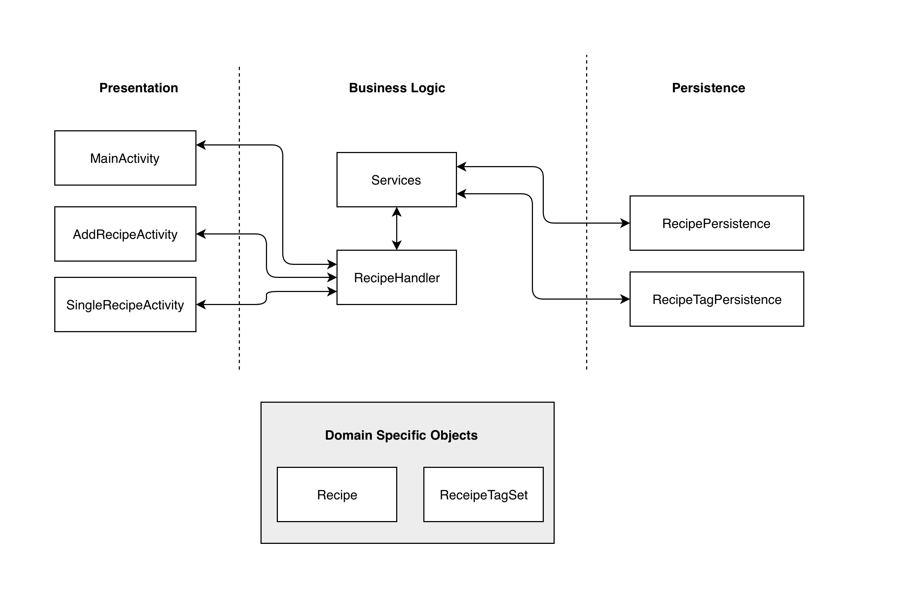

# Architecture

**Directory of Classes and their locations**

## Diagram

## Presentation Layer
[MainActivity](https://code.cs.umanitoba.ca/comp3350-summer2019/cook-eBook/blob/master/app/src/main/java/com/cook_ebook/presentation/MainActivity.java)
- The file for the view for the starting screen of the app

[AddEditView](https://code.cs.umanitoba.ca/comp3350-summer2019/cook-eBook/blob/master/app/src/main/java/com/cook_ebook/presentation/AddEditView.java)
- The file for the view for adding or editing a recipe

[RecyclerViewAdapter](https://code.cs.umanitoba.ca/comp3350-summer2019/cook-eBook/blob/master/app/src/main/java/com/cook_ebook/presentation/RecyclerViewAdapter.java)
- A supporting view file for the MainActivity

[SingleRecipe](https://code.cs.umanitoba.ca/comp3350-summer2019/cook-eBook/blob/master/app/src/main/java/com/cook_ebook/presentation/SingleRecipe.java)
- The file for the view for viewing a single recipe

## Logic Layer
[RecipeHandler](https://code.cs.umanitoba.ca/comp3350-summer2019/cook-eBook/blob/master/app/src/main/java/com/cook_ebook/logic/RecipeHandler.java)
- The main class that the presentation layer will call to do stuff with the data

[Services](https://code.cs.umanitoba.ca/comp3350-summer2019/cook-eBook/blob/master/app/src/main/java/com/cook_ebook/logic/Services.java)
- The main class that deals with the persistence layer for the Recipe Handler

## Persistence Layer
[RecipePersistence](https://code.cs.umanitoba.ca/comp3350-summer2019/cook-eBook/blob/master/app/src/main/java/com/cook_ebook/persistence/RecipePersistence.java):
- The interface for the recipe in the database

[RecipeTagPersistence](https://code.cs.umanitoba.ca/comp3350-summer2019/cook-eBook/blob/master/app/src/main/java/com/cook_ebook/persistence/RecipeTagPersistence.java):
- The interface for the set of tags for a recipe in the database

[RecipePersistenceStub](https://code.cs.umanitoba.ca/comp3350-summer2019/cook-eBook/blob/master/app/src/main/java/com/cook_ebook/persistence/stubs/RecipePersistenceStub.java)
- Current Recipe implementation for the "database" for the app (real database will be implemented in a later iteration)

[RecipeTagPersistenceStub](https://code.cs.umanitoba.ca/comp3350-summer2019/cook-eBook/blob/master/app/src/main/java/com/cook_ebook/persistence/stubs/RecipeTagPersistenceStub.java)
- Current RecipeTag implementation for the "database" for the app (real database will be implemented in a later iteration)

## Domain Specific Objects
[Recipe](https://code.cs.umanitoba.ca/comp3350-summer2019/cook-eBook/blob/master/app/src/main/java/com/cook_ebook/objects/Recipe.java):
- The recipe object

[RecipeTagSet](https://code.cs.umanitoba.ca/comp3350-summer2019/cook-eBook/blob/master/app/src/main/java/com/cook_ebook/objects/RecipeTagSet.java):
- The object for the set of tags for a recipe

## Docs

[View other docs](docs\)